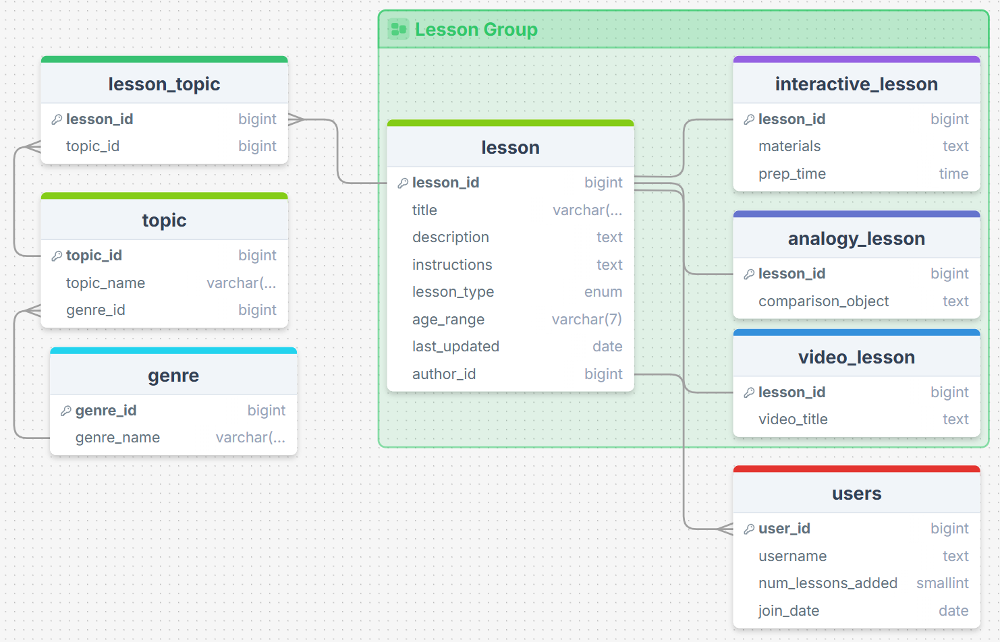

# Project Initial Design
For summary and overview of project see the README

## ERD Diagram

Data will come from user input

## System Design

## Goals

### Phase 1: Foundations & Database Setup (Week 1)
* Nov 4 (Tue): Setup. Create your free Supabase account and a new project. Familiarize yourself with the dashboard. Get your Project URL and API keys.
* Nov 5 (Wed): DB Schema. Go to the Supabase SQL Editor. Write and run the SQL to create your genres and topics tables. Add the foreign key from topics to genres.
* Nov 6 (Thu): DB Schema. Write and run the SQL to create your users and lessons tables. Add the foreign key from lessons to users (for the author_id).
* Nov 7 (Fri): DB Schema. Write and run the SQL for the many-to-many relationship: create the lesson_topics_junction table with foreign keys to lesson_id and topic_id.
* Nov 8 (Sat): Web Setup. On your local computer, run npx create-next-app to create your Next.js project. Install the @supabase/supabase-js library.
* Nov 9 (Sun): Web Setup. Connect your Next.js app to Supabase. Create the Supabase client file (/utils/supabaseClient.js) with your API keys.
* Nov 10 (Mon): Learning & Testing. Follow a basic Next.js + Supabase tutorial for fetching data. Create a test page that successfully queries your genres table and prints the results. This proves your connection works.

### Phase 2: Core Feature - "Create" (Week 2)
* Nov 11 (Tue): UI Build. Create a new page in Next.js (/submit). Build the basic HTML form for submitting a lesson (e.g., `<input>` for title, `<textarea>` for description, `<input>` for age_range).
* Nov 12 (Wed): Data Fetching (for Form). On your /submit page, fetch data from your topics table and use it to populate a list of checkboxes.
* Nov 13 (Thu): Form Logic. Use React's useState hook to capture and store the user's input from the form fields and checkboxes.
* Nov 14 (Fri): "Create" Logic (Part 1). Write the "on submit" function. This function will first INSERT the main lesson data (title, description) into the lessons table.
* Nov 15 (Sat): "Create" Logic (Part 2). After the lesson insert is successful, get the lesson_id of the new row. Then, INSERT the selected topic IDs into the lesson_topics_junction table.
* Nov 16 (Sun): Testing & Seeding. Test your submit form end-to-end. Manually add 5-10 more lessons and topics directly in the Supabase dashboard so you have data to work with.
* Nov 17 (Mon): Styling. Add basic CSS (or Tailwind CSS) to your /submit page so it's clean and usable.

### Phase 3: Core Feature - "Read" (Week 3)
* Nov 18 (Tue): UI Build. On your home page (/), build the search and filter UI (e.g., a text input for search, dropdowns for genres and topics).
* Nov 19 (Wed): "Read" Logic (Simple). Write the function to fetch and display all lessons from your lessons table on the home page.
* Nov 20 (Thu): UI Build. Create a reusable "LessonCard" React component to display the title and description of a single lesson.
* Nov 21 (Fri): "Read" Logic (Filtering). Add logic to your Supabase query to filter lessons based on the age_range or genre selected in the dropdowns.
* Nov 22 (Sat): "Read" Logic (JOINs). This is a key database task. Write a Supabase RPC (PostgreSQL Function) that uses JOINs to find lessons that match a specific topic_id. Call this function from your app.
* Nov 23 (Sun): Routing. Set up dynamic routing in Next.js. Make each "LessonCard" a link that goes to a unique page (e.g., /lessons/[id]).
* Nov 24 (Mon): UI Build. Create the "Lesson Detail" page (/lessons/[id]/page.js). Write the query to fetch and display the full details for a single lesson.

### Phase 4: Advanced Features & Polish (Final Days)
* Nov 25 (Tue): "U/D" Logic. On the "Lesson Detail" page, add "Edit" and "Delete" buttons. Write the UPDATE and DELETE functions (the "U" and "D" in CRUD).
* Nov 26 (Wed): pgvector Setup. Go to the Supabase SQL Editor. Run CREATE EXTENSION vector;. Then, ALTER TABLE lessons ADD COLUMN embedding vector(384); (384 is a common dimension for small models).
* Nov 27 (Thu): (Thanksgiving) - Light Day. Read the pgvector documentation and research a simple "sentence-transformer" library for JavaScript. (Buffer Day).
* Nov 28 (Fri): pgvector Logic (Part 1). Write a server-side function. When a lesson is created/updated, use the sentence-transformer library to generate an embedding from its description, and UPDATE the lesson's embedding column.
* Nov 29 (Sat): pgvector Logic (Part 2). Write a new RPC (PostgreSQL Function) for semantic search. This function will take a search query, generate an embedding for it, and use the <=> (cosine distance) operator to find the 5 most similar lessons.
* Nov 30 (Sun): UI Build. Add a second search bar to your home page specifically for "Semantic Search." Hook it up to your new RPC function.
* Dec 1 (Mon): Polish & Deploy. Clean up the UI. Make sure it's presentable. Deploy your project to Vercel (it's free and designed for Next.js).
* Dec 2 (Tue): Testing & Readme. Test the live, deployed site. Write a README.md file for your project that explains what it is and how to run it.
* Dec 3 (Wed): Final Review. Do a final review of your project against your class rubric. Practice your presentation or write your final report. Project Complete.

